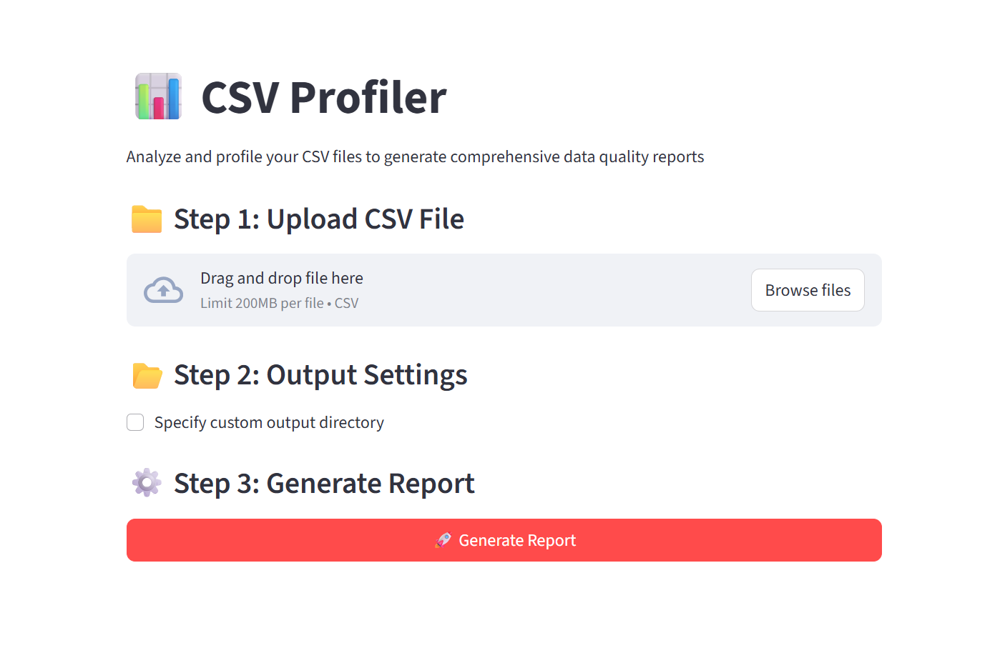

# CSV Profiler Tool
Follow these instructions to set up and run the project.

## 1. Clone the repo

`git clone https://github.com/Afra17/BootCamp_SDAIA`

`cd BootCamp_SDAIA`

## 2.1 Create virtual env 

`uv venv`
## 2.2 Activate environment

`.venv\Scripts\activate`

## 3. Install dependencies

`uv pip install -r requirements.txt`

## 4. Run your csv file

`python main.py path/to/your/file.csv`

if you want to use me csv file: (RUN)

`python main.py data/sample.py`

## You can specify where to save the reports using --output_dir:

`python main.py path/to/your/file.csv --output-dir my_reports`

# Streamlit (UI)

## 🚀 Usage Options

You have multiple ways to use this tool. Choose the one that suits your needs :)

### 🔹 Option 1: CSV Profiler Dashboard (Local Streamlit)
If you prefer an interactive visual interface running locally on your machine:

1. Ensure you have completed the **Installation steps (1-3)** above.
2. Run the following command:

`streamlit run streamlit_main.py`

<h1>📊 CSV Profiler Dashboard</h1>

  

BootCamp_SDAIA/
├── csv_profiler/    
|    ├── src/
|       ├── data
|       ├── main.py  
|       ├── csv_profiler/
|           ├── __init__.py
|           ├── cli.py
|           ├── io.py
|           ├── profile.py
|           └── render.py
|              
|              
├── requirements.txt    
└── README.md           
